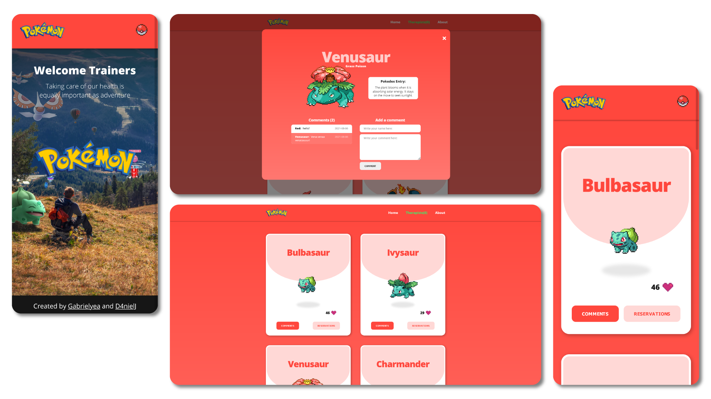

# JavaScript capstone project - PokeH
> PokeH is a web application based on an external API. It retrieves information from two different API's: [PokeApi](https://pokeapi.co/) and [InvolmentAPI from Microverse](https://www.notion.so/Involvement-API-869e60b5ad104603aa6db59e08150270) and brings new functionality by mixing both.

>Pokémon is Copyright Gamefreak, Nintendo and The Pokémon Company 2001-2016. All images and names owned and trademarked by Nintendo, Niantic, The Pokémon Company, and Gamefreak are property of their respective owners.

## Live Demo
You can see my page live here: 
[Check it out!](https://gabrielyea.github.io/pokemon-capstone/)

# Screenshots

## Built With 🔨
- HTML
- SCSS
- javaScript
- Webpack

## Feature video 📹
[Watch us](https://loom.com/share/4e414dff3c0e4c0a809998bfc3247065) give a little description of our web app.

## Getting Started
To get a local copy running follow this steps!
- Clone this repo.
- `npm install` to install the packages
- `npm run start` to build dist files and run local server.

### Run tests
To run the test just use the following command!
- `npm test`

<!--To get a local copy up and running follow these simple example steps.

### Prerequisites

### Setup

### Install

### Usage

### Deployment-->

## Authors

👤 *Gabriel Rendon*

- GitHub: [@gabrielyea](https://github.com/gabrielyea)

👤 *Daniel Jaramillo*

- GitHub: [@D4nielJ](https://github.com/d4nielj)

## 🤝 Contributing

Contributions, issues, and feature requests are welcome!

<!--Feel free to check the [issues page](../../issues/).-->

## Show your support

Give a ⭐️ if you like this project!

<!--## Acknowledgments-->

## 📝 License

This project is [MIT](./MIT.md) licensed.
